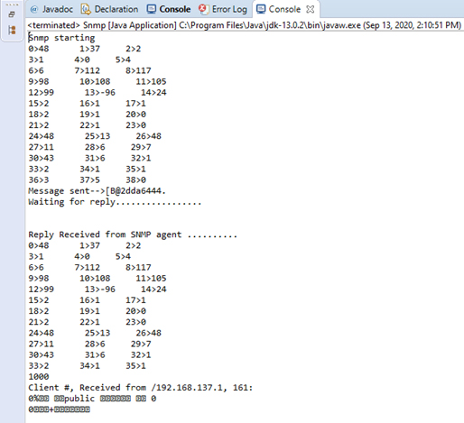

# Ahmed-Basalib-SNMP-GetRequest-Message-Implementation-In-Java
# SNMP
SNMP stands for Simple Network Monitoring Protocol.\
It is a protocol for management information transfer in networks,for use in LANs especially, depending on the chosen version.\
## SNMP components:
•	SNMP Manager –\
It is a centralised system used to monitor network.It is also known as Network Management Station (NMS)\
•	SNMP agent –\
It is a software management software module installed on a managed device. Managed devices can be network devices like PC, router, switches, servers etc.\
•	Management Information Base –\
MIB consists of information of resources that are to be managed. These information is organised hierarchically. It consists of objects instances which are essentially variables.\ SNMP messages –\
Different variables are:\
•	GetRequest –\
SNMP manager sends this message to request data from SNMP agent. It is simply used to retrieve data from SNMP agent.\
In response to this, SNMP agent responds with requested value through response message.\
•	GetNextRequest –\
This message can be sent to discover what data is available on a SNMP agent. The SNMP manager can request for data continuously\
until no more data is left. In this way,SNMP manager can take knowledge of all the available data on SNMP agent.\
 etc
 
 ## SNMP versions –
•	SNMPv1 –\
It uses community strings for authentication and use UDP only.\
•	SNMPv2c –
Itusescommunity stringsforauthentication. ItusesUDPbutcanbeconfiguredtouse TCP.\
•	SNMPv3 –\
ItusesHashbasedMACwith MD5orSHAforauthenticationandDES-56for privacy.This version uses TCP. Therefore, conclusion is the higher the version of SNMP, more secure it will be.\

## output screenshot

